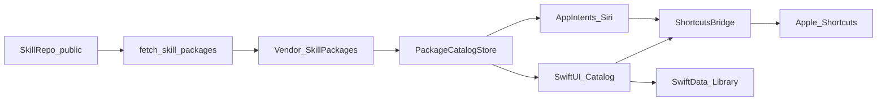

# Horizon iOS — architecture

## Module map

```text
HorizonApp/
  App/
    HorizonApp.swift              @main, WindowGroup, deep-link onOpenURL
    RootTabView.swift             Library | Catalog | Settings
  Catalog/
    PackageCatalogStore.swift     @Observable — loaded manifests
    CatalogListView.swift
    PackageDetailView.swift
  Library/
    InstalledPackage.swift        SwiftData @Model
    LibraryStore.swift
    LibraryListView.swift
  ShortcutsBridge/
    ShortcutsURLBuilder.swift     import / run / open
    ShortcutInstaller.swift
    ShortcutRunner.swift
  DeepLink/
    HermesShortcutsRouter.swift   hermes-shortcuts://edit
  Intents/
    InstallPackageIntent.swift
    RunPackageIntent.swift
    BrowseCatalogIntent.swift
    HorizonAppShortcuts.swift     AppShortcutsProvider
  Models/
    HorizonPackage.swift          Codable mirror of horizon-package/v1
    ModelPolicy.swift
    ModelRouter.swift
    AttestationStatus.swift
  Vendor/                         (gitignored build input — CI fetch output)
    SkillPackages/
      <id>/package.json
      shortcuts/...               mirrored XML
  Resources/
    PrivacyInfo.xcprivacy
    Localizable.xcstrings
```

## Data flow



## Trust boundaries

| Boundary | Rule |
|----------|------|
| Skill → App | Read-only fetch of MIT packages + XML ; pin immutable ref |
| App → Shortcuts | OS URL schemes only ; user sees system prompts |
| App → Network | Optional refresh to GitHub raw/release assets ; no package code exec |
| Deep link `path` | Must match allowlisted relative path pattern ; no `..` escape |
| ModelRouter | On-device preferred ; cloud only if policy + user consent |

## Package model (Swift mirror)

Mirror fields from [`../../data/schemas/horizon-package.v1.json`](../../data/schemas/horizon-package.v1.json):

- `schema`, `id`, `name`, `version`, `license`, `description`, `tags`
- `model_policy`, `siri_phrases`, `shortcuts[]`, `attestation`, `edit`

Unknown `additionalProperties` : ignore (forward compatible).

## Fetch layout (CI)

```text
Vendor/SkillPackages/
  hello-world/package.json
  hello-world/shortcuts/01-hello-world.shortcut.xml   # rewritten local path optional
  …
  catalog.json   # optional index generated by fetch script
```

In-app, `shortcuts[].path` may be rewritten to vendor-relative paths by the fetch
script so the app never needs the full skill tree.

## Concurrency

- Stores `@Observable` + `@MainActor` (Swift 6 default isolation).
- Fetch/parse JSON : `@concurrent` or detached task → publish on main.
- SwiftData : main context UI ; no sendable `@Model` across actors.

## Extension points (post-oneshot)

- Signed shortcut CDN
- CloudKit sync
- Mac Catalyst / multiplatform target
- In-app authoring (still prefer skill)
