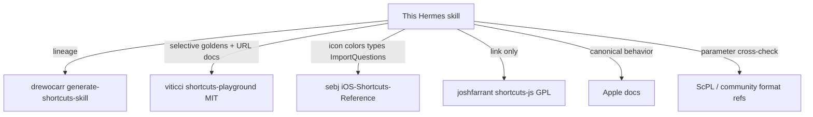

# Ecosystem — external sources (central index)

This skill stays **small and Hermes-focused**. It does **not** absorb every Shortcuts
repo on GitHub. Instead we keep a machine-readable registry and selective vendors.

| Artifact | Role |
|----------|------|
| [`data/sources.json`](../data/sources.json) | SSOT registry (URL, license, use, `last_checked`) |
| [`data/schemas/sources.v1.json`](../data/schemas/sources.v1.json) | Shape + integrity gate |
| [`data/external/*.index.jsonl`](../data/external/) | Remote corpus indexes (metadata only) |
| [`data/external/viticci-gaps.jsonl`](../data/external/viticci-gaps.jsonl) | Viticci goldens **not** vendored here |
| [`templates/examples/community/`](../templates/examples/community/) | Few MIT-vendored goldens that fill gaps |
| [`THIRD_PARTY_NOTICES.md`](../THIRD_PARTY_NOTICES.md) | Attribution |
| [`scripts/check_sources.py`](../scripts/check_sources.py) | CI integrity |
| [`scripts/refresh_external_indexes.sh`](../scripts/refresh_external_indexes.sh) | Re-fetch Viticci index + rebuild gaps |

## Policy (short)

1. **Link** peer skills and GPL tooling — do not copy wholesale.
2. **Index** large golden corpora (titles/tags/paths) without cloning XML by default.
3. **Vendor** only when: compatible license + passes `./scripts/validate.sh` + fills a gap + attributed.
4. Prefer **export-diff from Shortcuts.app** over inventing parameters for undocumented actions.
5. Official Apple docs beat blogs when behavior disagrees.

## Map



## Highest-value peers

| Source | Why it matters | What we take |
|--------|----------------|--------------|
| [viticci/shortcuts-playground-plugin](https://github.com/viticci/shortcuts-playground-plugin) | Best-in-class agent skill + 19 goldens | Index + **11** community XMLs + URL patterns; **8** gaps indexed |
| [drewocarr/generate-shortcuts-skill](https://github.com/drewocarr/generate-shortcuts-skill) | Upstream skill lineage | Historical baseline (license unspecified) |
| [sebj/iOS-Shortcuts-Reference](https://github.com/sebj/iOS-Shortcuts-Reference) | Classic format/ARGB/types (archived) | Colors + types cited into PLIST_FORMAT / URL_SCHEMES |
| [Apple Shortcuts User Guide](https://support.apple.com/guide/shortcuts/welcome/ios) | Official product behavior | Link / cite |
| [Apple App Intents](https://developer.apple.com/documentation/appintents) | Siri / Horizon / `appintentexecution` | Link; never invent IDs |
| [joshfarrant/shortcuts-js](https://github.com/joshfarrant/shortcuts-js) | Mature JS generator (archived, GPL) | **Link only** |
| [ScPL docs](https://docs.scpl.dev/) | Action parameter keys | Cross-check only |
| [0xdevalias gist](https://gist.github.com/0xdevalias/27d9aea9529be7b6ce59055332a94477) | iCloud → bplist → `plutil` | Linked for extract |
| [RoutineHub Source Tool](https://routinehub.co/shortcut/5256/) | On-device source inspect | Link for human debugging |

**Closing the authoring gap (without absorbing Viticci):** see [`COMPETITIVE_CHECKLIST.md`](COMPETITIVE_CHECKLIST.md).

## Parity notes (V0 — 2026-07-26)

Snapshot of [viticci/shortcuts-playground](https://github.com/viticci/shortcuts-playground-plugin) authoring surface vs this skill:

| Peer capability | Viticci | Our lean equivalent (target) |
|-----------------|---------|------------------------------|
| Build from scratch | `/shortcuts-playground:build` + builder agent | `SKILL.md` steps 1–9 + goldens |
| Remix / surgical diff | `/shortcuts-playground:remix` + remixer agent | **`references/REMIX.md` + `scripts/remix_shortcut.py`** |
| Validate on edit | PostToolUse → `validate-shortcut` (Craig Loop) | **`scripts/validate_on_write.sh`** |
| Sign wrapper | `sign-shortcut` | `scripts/sign_shortcut.sh` |
| Icon resolver | `resolve-icon` | Table in `PLIST_FORMAT.md` |
| ToolKit allowlists | v63 + v78 gated JSON catalogs | `data/wf_actions.json` (**446**) + `appintents.json` (168 curated; see `APPINTENTS_GAP.md`) |
| Goldens | ~19 playground XMLs | 10 teaching + **16** palette + **11** community |
| Attestation Mac import/run | Not first-class | **`attest_local.sh --auto` + `results.json`** (lead) |

**Do not copy:** BEST_PRACTICES monolith, ToolKit v78 dumps wholesale, Claude-only hooks/agents, HealthKit pack until needed.

## Community goldens vendored here

See [`templates/examples/community/README.md`](../templates/examples/community/README.md).

| File | Upstream title | Gap filled |
|------|----------------|------------|
| `09-url-cleaner.shortcut.xml` | URL Cleaner | Real-world URL/text cleanup |
| `10-parse-json-feed.shortcut.xml` | Parse JSON Feed | HTTP + dictionary + choose-from-list |
| `11-invert-names.shortcut.xml` | Invert Names | Text / list transform |
| `12-days-in-a-month.shortcut.xml` | Days In a Month | Date math |
| `13-electricity-price.shortcut.xml` | Electricity Price | Network + dictionary |
| `14-preview-folder-contents.shortcut.xml` | Preview Folder Contents | Files / folder listing |
| `15-masto-redirect.shortcut.xml` | Masto-Redirect | HTTP + URL rewrite |
| `16-calendar-locations.shortcut.xml` | Calendar Locations | Calendar + locations |
| `17-create-calendar-event-from-template.shortcut.xml` | Create Calendar Event from Template | Calendar + dictionary template |
| `18-select-folder-compress-share.shortcut.xml` | Select Folder, Compress, and Share | Files + zip + share |
| `19-app-release-notes.shortcut.xml` | App Release Notes | App Store search + regex + clipboard |

Full upstream catalog (19): `data/external/viticci-playground-goldens.index.jsonl`.  
**Not vendored (8):** `data/external/viticci-gaps.jsonl` (Evernote / Dropbox / Toggl / WordleBot / Clip to iCloud Clipboard / remaining App Store).

Skipped on purpose (not lean): Evernote, Toggl, Dropbox, heavy clipboard suite, remaining App Store API goldens.

## Refreshing indexes

```bash
./scripts/refresh_external_indexes.sh
# or manually:
curl -sL \
  https://raw.githubusercontent.com/viticci/shortcuts-playground-plugin/main/claude/skills/shortcuts-playground/golden-shortcuts/index.jsonl \
  -o data/external/viticci-playground-goldens.index.jsonl
./scripts/check_sources.py
```

To vendor another MIT golden: download XML → add attribution comment → place under
`templates/examples/community/` → update `sources.json` `vendored_examples` + notices →
`./scripts/refresh_external_indexes.sh` → `./scripts/validate.sh`.

## What not to do

- Do not submodule GPL `shortcuts-js` into this MIT repo.
- Do not paste Viticci’s entire ~12k-line skill tree (keep Hermes skill lean; point agents at ECOSYSTEM when needed).
- Do not treat RoutineHub iCloud links as permanent fixtures (they rot).
- Do not revive Locally→Obsidian as a golden — product direction is [`HORIZON.md`](HORIZON.md).
- Do not mark AppIntent IDs verified from blog posts alone — export-diff on device.
